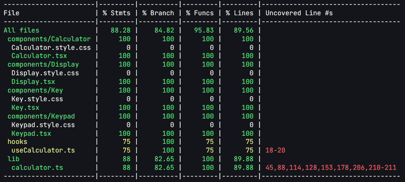
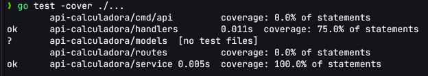

# Full Stack calculator

A full-featured calculator with a **React + TypeScript (Vite)** frontend and a **Go (Gin)** backend, communicating via a **REST API**. It includes basic and advanced arithmetic operations, input validation, unit tests for both layers and Docker container deployment.

---

## Project Structure

```
.
├── calculator-api/        # Backend Go
├── calculator-client/      # Frontend React with TypeScript
├── compose.yml             
└── README.md               
```

---

## Technologies

| Layer       | Stack                                                        |
|-------------|--------------------------------------------------------------|
| Backend     | Go 1.26, Gin, Gin-CORS, tests with `testing` library         |
| Frontend    | React 19, TypeScript, Vite, Vitest                           |
| Infra       | Docker, Docker Compose                                       |

---

## How to run it

### Clone the repo
```bash
git clone https://github.com/Drivasx/calculator-fullstack
```

### Move to the directory
```bash
cd calculator-fullstack
```


### Option A: Docker Compose


Run everything:

```bash
docker compose up -d --build
```

- Frontend → http://localhost:5173
- Backend  → http://localhost:8080

---

## API uses examples

All endpoints are `POST` with JSON body and returns `{"result": ...}`.

**Binary operations** (body: `{ "a": ..., "b": ... }`):

```bash
curl -X POST http://localhost:8080/api/v1/calculator/add \
  -H "Content-Type: application/json" \
  -d '{"a": 7, "b": 3}'
# => {"result":10}

curl -X POST http://localhost:8080/api/v1/calculator/multiply \
  -H "Content-Type: application/json" \
  -d '{"a": 4, "b": 5}'
# => {"result":20}

curl -X POST http://localhost:8080/api/v1/calculator/pow \
  -H "Content-Type: application/json" \
  -d '{"a": 2, "b": 8}'
# => {"result":256}
```

**Unary operations** (body: `{ "b": ... }`):

```bash
curl -X POST http://localhost:8080/api/v1/calculator/sqrt \
  -H "Content-Type: application/json" \
  -d '{"b": 9}'
# => {"result":3}

curl -X POST http://localhost:8080/api/v1/calculator/percentage \
  -H "Content-Type: application/json" \
  -d '{"b": 50}'
# => {"result":0.5}
```

**Error handling** 

```bash
curl -X POST http://localhost:8080/api/v1/calculator/divide \
  -H "Content-Type: application/json" \
  -d '{"a": 10, "b": 0}'
# => 400 {"error":"You cannot divide by zero."}

curl -X POST http://localhost:8080/api/v1/calculator/sqrt \
  -H "Content-Type: application/json" \
  -d '{"b": -16}'
# => 400 {"error":"You cannot get the square root of a negative number."}
```

---


## Tests and coverage

| Layer   | command                                                   | 
|---------|-----------------------------------------------------------|
| Backend | `cd calculator-api && go test -cover ./...`               | 
| Frontend| `cd calculator-api && npm run coverage`                   | 

backend:



---

frontend:



---

## Design Decisions

Go + Gin Backend (test requirement). Kept the REST API simple and explicit: one endpoint per operation instead of a single overloaded /calculate route with too many fields. It makes the code much easier to read, test, and validate.

Clean Separation (service / handler / model): Calculation logic stays strictly inside service/ (pure Go, zero Gin dependencies). Handlers only handle request binding and delegation, while models define the JSON contract. This lets us test 100% of the core service logic without spinning up HTTP.

Validation using Pointers + binding:"required": Fields use *float64 so 0 is treated as a valid number, while a missing or null field properly returns a 400 response without throwing nil pointer panics.

Centralized CORS Middleware in Gin: Configured with an explicit whitelist of allowed origins (strictly the frontend app). Avoided using the * wildcard to keep the API secure.

Pure Reducer on the Frontend: All state management—handling digits, decimals, pending operators, chaining, and error states—lives inside src/lib/calculator.ts as pure functions. This allows thorough testing without needing to mount React components.


## Used prompts

AI used: OpenCode

1. "Le estoy pasando los tests al reducer de la calculadora y ya me cubre sumas y restas, pero quiero probar las operaciones haciendo tabla como en Go. En vitest existe algo parecido a los table tests de Go o tengo que escribir un test por operación? y cómo mido la cobertura en el frontend?"
2. "Cuando el usuario pulsa 5 + y después √ no me queda claro cuándo se lanza la petición a la API. Quiero un test que simule pulsar teclas y espere a que termine la llamada asíncrona antes de mirar el resultado, porque ahora el test termina antes y me da el estado viejo. Cómo lo hago con vi.fn y await?"
3. "Tengo un test de la calculadora que dice 4 × -6 = -24 pero el -6 va negativo y no sé si el mock del servicio tiene que devolver la multiplicación o si el reducer debería encargarse de los negativos. Como es medio culpa del uno y del otro, no sé dónde ponerme a testear."
Java → Go (2)
4. "Vengo de Java y en Spring poníamos un @Service con @RestController y los métodos saltaban excepciones tipo ArithmeticException si dividías entre cero. En Go no veo try-catch. Cómo le explico al resto del código que la división entre cero falló si no hay excepciones? He visto que se devuelve un error como segundo valor, pero no entiendo bien cuándo se usa."
5. "En Java usaba JUnit con @Test y assertEquals y todo iba en métodos. Ahora en Go los tests van pegados a los archivos y no sé cómo estructurar uno que pruebe varias operaciones de la calculadora sin escribir un test gigante. Me dijeron que Go usa table tests, me puedes enseñar con un ejemplo del Add y del Sqrt?"
Dudas frontend React (6,7,8)
6. "Estoy haciendo la calculadora con React y TypeScript y cada vez que pulso una tecla cambia el estado. Lo estoy metiendo todo en un useReducer, pero las operaciones van al backend por fetch y no sé si lo asíncrono lo meto dentro del reducer o fuera. Me da la sensación de que al reducer no le toca esperar una promesa, pero tampoco quiero duplicar la lógica."
7. "Monté la calculadora así y la puse encima del resultado en una expresión tipo '7 + 3 =', pero noté que cuando pones un número negativo después de un operador (4 × -6) queda todo junto y se lee mal. Quiero encerrar el negativo entre paréntesis en la expresión pero solo cuando va después de un operador, no al principio. Hay forma de saber en el reducer en qué posición va el operando?"
8. "El porcentaje de la calculadora lo hice como operación unaria que divide entre 100, pero no sé si la parte del frontend que lanza el fetch pide solo el valor o también hace algo de la aritmética. Quiero que la división entre 100 la haga el backend y que el frontend solo le pase el número. Cómo compruebo en un test del reducer que la llamada a la API recibe lo que corresponde?"
